# [飞桨学习赛: 英雄联盟大师预测](https://aistudio.baidu.com/competition/detail/797/0/task-definition)

- [飞桨学习赛: 英雄联盟大师预测](#飞桨学习赛-英雄联盟大师预测)
  - [Highlights](#highlights)
  - [文件结构](#文件结构)
  - [赛题介绍](#赛题介绍)
  - [特征工程与可视化](#特征工程与可视化)
    - [安装依赖](#安装依赖)
    - [数据预处理](#数据预处理)
    - [数据可视化](#数据可视化)
  - [算法对比](#算法对比)
  - [XGBoost可视化](#xgboost可视化)
  - [MLP训练](#mlp训练)
  - [测试集上的结果](#测试集上的结果)

## Highlights

- 对数据进行**log化处理**转化为近似正态分布，减少异常值对模型的影响，提高模型泛化能力；
- 通过**基于遗传算法的符号回归**生成高质量特征，挖掘数据集中隐藏的非线性关系，提高模型对复杂关系的建模能力；
- 对比常见的机器学习分类器算法，并在此基础上使用**网格搜索**的方式进一步调优，充分发挥模型性能。

该方案在测试集上取得了**0.8595**的Accuracy。

## 文件结构

```
.
├── README.md             # 本文件
├── algorithm             # 所有的机器学习算法  
├── data                  # 数据集
├── data_preprocess.py    # 数据预处理脚本
├── dev                   # 包括ROC曲线、XGBoost可视化的绘制脚本 
├── figs                  # 图片文件夹
├── predict.py            # XGBoost预测脚本
├── predict_mlp.py        # MLP预测脚本
├── requirements.txt      # 依赖
├── submission.csv        # XGBoost预测结果
└── visualization.py      # 数据可视化脚本
```

## 赛题介绍

给定用户在游戏中的对局数据，如击杀数、住物理伤害等，预测该用户是否获胜。数据集由20万条数据构成，来自知名游戏LoL：
| 类别   | 训练集 | 测试集 | 总计  |
| ------ | ------ | ------ | ------ |
| 胜利   |  89991   |  -   |  -   | 
| 失败   |  90009   |   -  |   -  |
| 全部   |  180000  | 20000 | 200000 |

每一个对局数据有31特征和1个标签，每个特征的具体信息如下：

- `id`: 玩家记录id。
- `win`: 是否胜利，标签变量
- `kills`: 击杀次数
- `deaths`: 死亡次数
- `assists`: 助攻次数
- `largestkillingspree`: 最大 killing spree（游戏术语，意味大杀特杀。当你连续杀死三个对方英雄而中途没有死亡时）
- `largestmultikill`: 最大mult ikill（游戏术语，短时间内多重击杀）
- `longesttimespentliving`: 最长存活时间
- `doublekills`: doublekills次数
- `triplekills`: triplekills次数
- `quadrakills`: quadrakills次数
- `pentakills`: pentakills次数
- `totdmgdealt`: 总伤害
- `magicdmgdealt`: 魔法伤害
- `physicaldmgdealt`: 物理伤害
- `truedmgdealt`: 真实伤害
- `largestcrit`: 最大暴击伤害
- `totdmgtochamp`: 对对方玩家的伤害
- `magicdmgtochamp`: 对对方玩家的魔法伤害
- `physdmgtochamp`: 对对方玩家的物理伤害
- `truedmgtochamp`: 对对方玩家的真实伤害
- `totheal`: 治疗量
- `totunitshealed`: 痊愈的总单位
- `dmgtoturrets`: 对炮塔的伤害
- `timecc`: 法控时间。
- `totdmgtaken`: 承受的伤害
- `magicdmgtaken`: 承受的魔法伤害
- `physdmgtaken`: 承受的物理伤害
- `truedmgtaken`: 承受的真实伤害
- `wardsplaced`: 侦查守卫放置次数
- `wardskilled`: 侦查守卫摧毁次数
- `firstblood`: 是否为firstblood

## 特征工程与可视化

### 安装依赖

```bash
pip install -r requirements.txt
```

### 数据预处理

```bash
python data_process.py
```

删去了`id`和`timecc`这两个无用数据，对剩余的所有数据进行对数处理，利用SymbolicTransformer自动挖掘10个特征。

### 数据可视化

```bash
python draw_distribution.py
```

特征的分布直方图：

<div align=center>
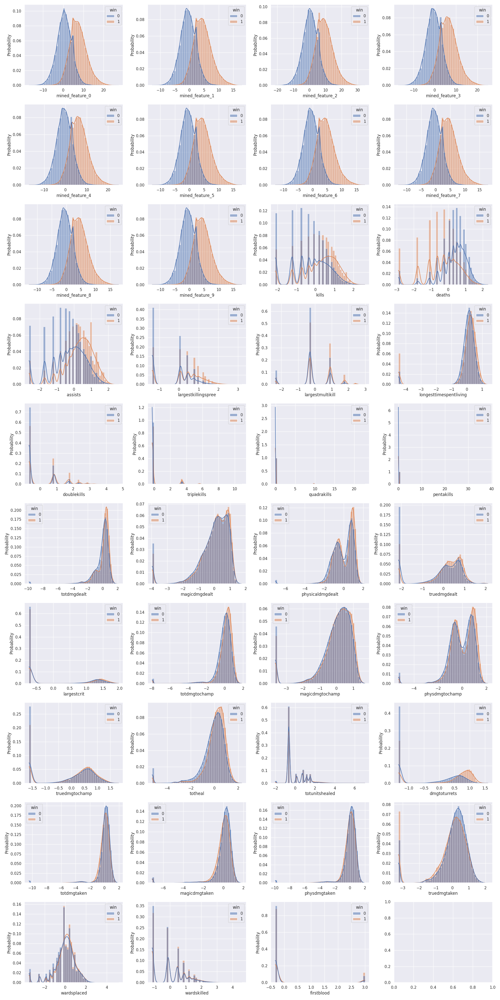
</div>
</br>

箱线图：

<div align=center>
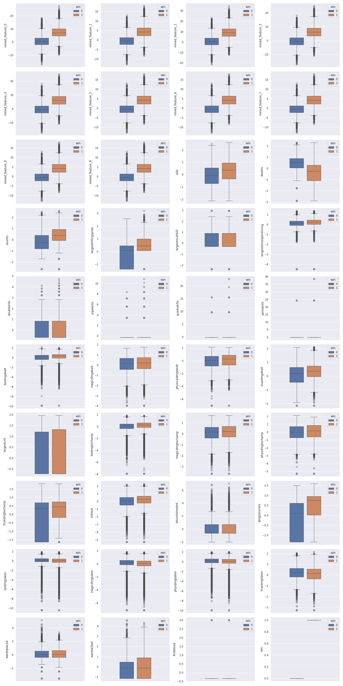
</div>
</br>

相关性矩阵与t-SNE降维：

<div align=center>
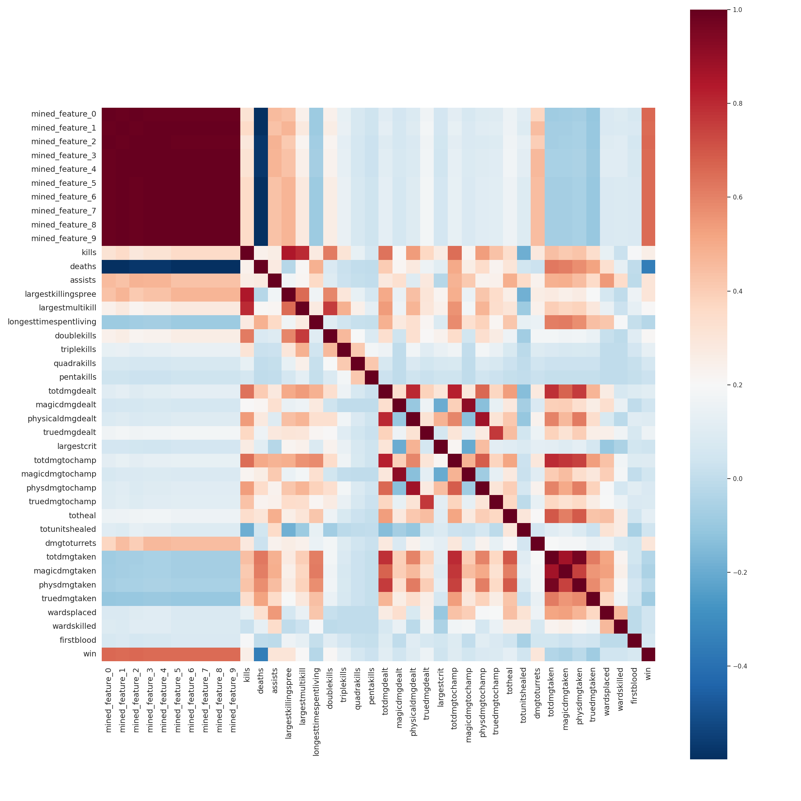
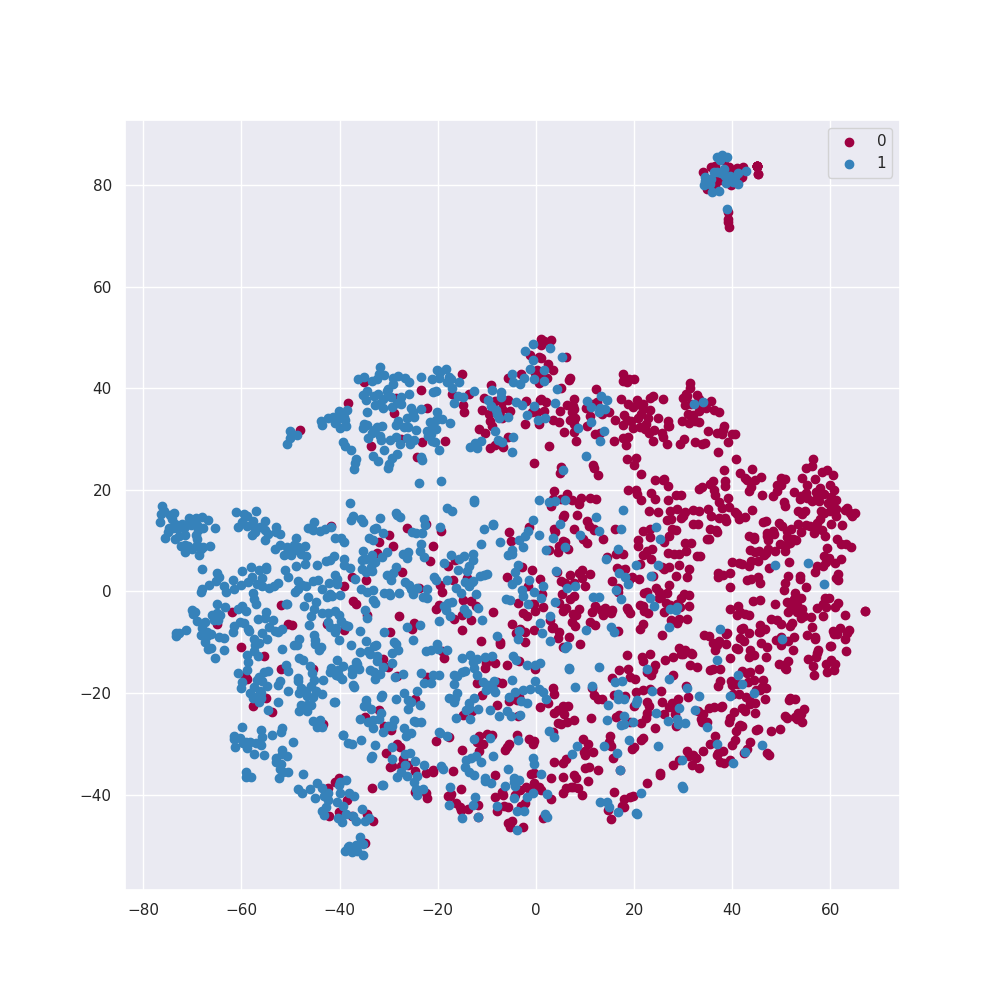
</div>
</br>

## 算法对比

我们对比了不同模型在训练集上的5折交叉验证下的Accuracy，结果如下：

| 算法           | Split 1 | Split 2 | Split 3 | Split 4 | Split 5 | 平均值    |
| -------------- | ------- | ------- | ------- | ------- | ------- | -------- |
| 决策树         | 0.8182  | 0.8192  | 0.8241  | 0.8245  | 0.8220  | 0.8216   |
| 支持向量机     | 0.8459  | 0.8429  | 0.8429  | 0.8439  | 0.8476  | 0.8446   |
| 朴素贝叶斯     | 0.8068  | 0.8065  | 0.8043  | 0.8058  | 0.8100  | 0.8067   |
| 随机森林       | 0.8360  | 0.8368  | 0.8367  | 0.8346  | 0.8411  | 0.8371   |
| 逻辑回归       | 0.8229  | 0.8205  | 0.8208  | 0.8199  | 0.8254  | 0.8219   |
| 多层感知机     | 0.8578  | 0.8567  | 0.8612  | 0.8562  | 0.8566  | 0.8577   |
| XGBoost        | 0.8589  | 0.8556  | 0.8555  | 0.8532  | 0.8592  | 0.8565   |

部分算法的ROC曲线，如下图所示：

<div align=center>
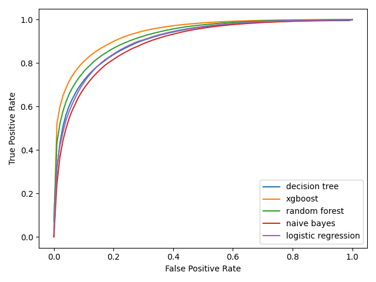
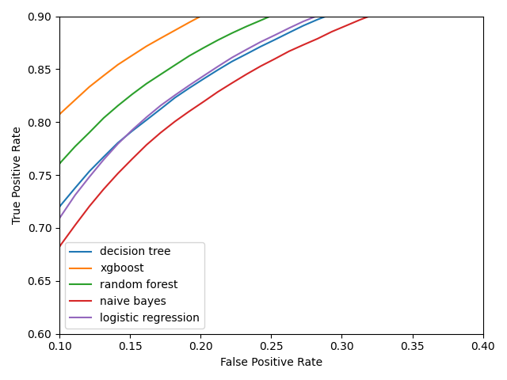
</div>
</br>

## XGBoost可视化

使用XGBoost的`plot_importance`方法可视化特征重要性：

<div align=center>
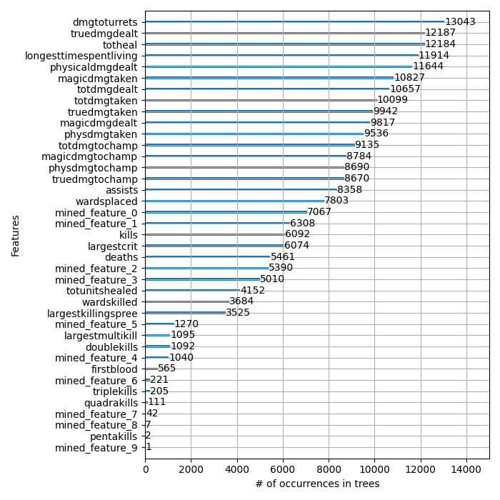
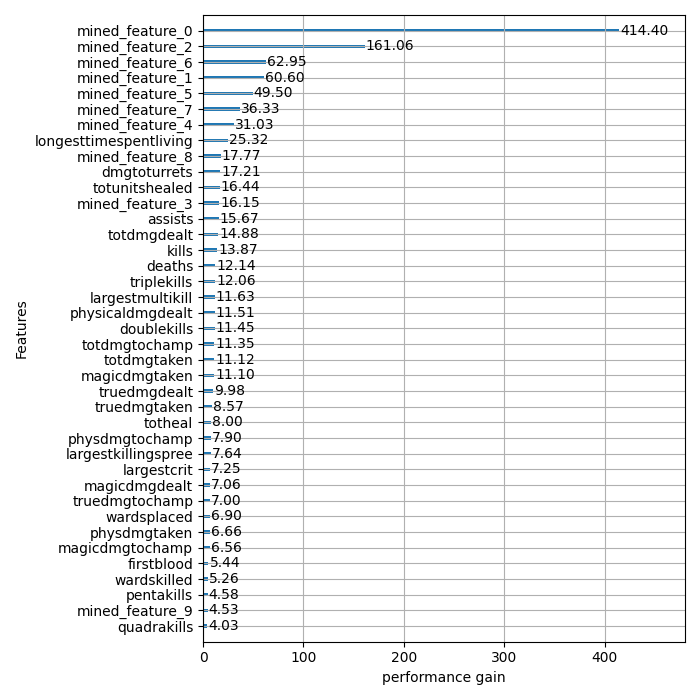
</div>
</br>

使用`plot_tree`方法可视化决策树，其中第1、10、100、1000、5000、8000棵Boosting树如下：

<div align=center>
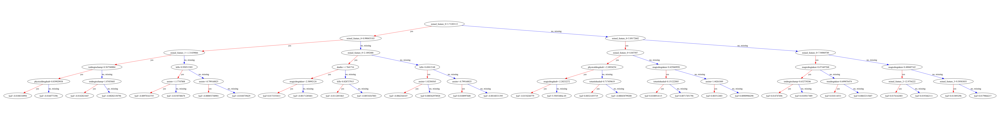
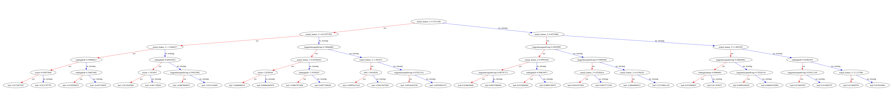
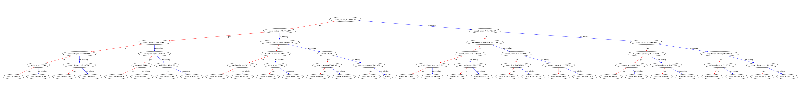
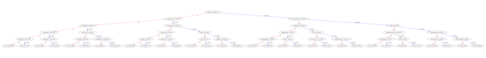
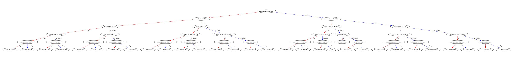
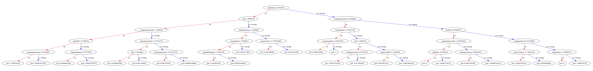
</div>
</br>

在预测测试集标签时，我们首先利用交叉验证的划分分别训练5个分类器，然后用每个分类器在测试集上进行预测，将5个结果进行平均，得到最终的预测结果。

## MLP训练

MLP的模型结构如下图所示：

<div align=center>
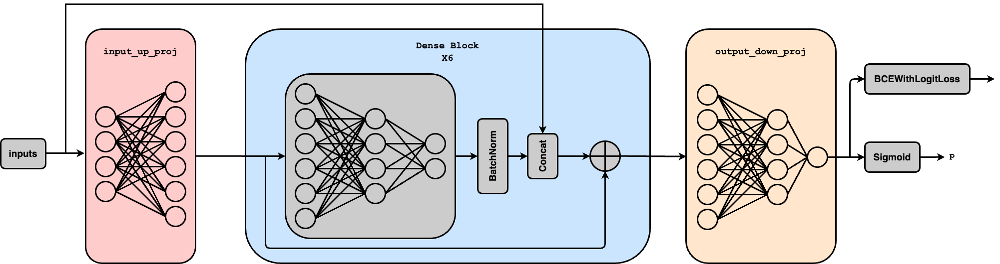
</div>
</br>

它由三个部分组成：
1. `input_up_proj`: 一层神经网络，输入维度为39，输出维度为58，没有激活函数；
2. 6层`Dense Block`: 每一个Block输入是58维特征，经过两层神经网络后降维至19维，激活函数采用`LeakyReLU`，使得在输入为负值时函数仍然有梯度，接着使用`Dropout`技术缓解过拟合，使用`BatchNorm`技术加速模型收敛提高模型稳定性，得到的向量和最原始的输入特征拼接起来，形成一个58维的向量，之后再通过残差连接防止过拟合；
3. `output_down_proj`: 两层神经网络，将输入的58维向量转换为1维向量，经过`sigmoid`激活后得到类别的概率 $p$ ，$p>0.5$ 认为是正样本(胜利)，否则为负样本(失败)。

不同`Dense Block`层数对结果的影响：
| Dense Block层数 | 训练集上的Accuracy | 验证集上的Accuracy |
| --------------- | ------------------ | ------------------ |
| 2               | 0.8548             | 0.8558             |
| 4               | 0.8576             | 0.8566             |
| 6               | 0.8603             | *0.8577*           |
| 8               | 0.8605             | 0.8573             |
| 10              | *0.8609*           | 0.8570             |

可以看出，6层Dense Block的效果最好，因此我们选择6层Dense Block作为最终的模型。

损失函数选择`BCEWithLogitsLoss`, 最大化二分类交叉熵；使用 AdamW 优化器优化参数；设置初始`learning rate = 0.01`，并且在训练过程中线性递减；设置`batch size = 8192`,  `epoch = 100`. 一共训练5次，每次抽取其中的20%作为验证集，其余作为训练集，记录每一个epoch的Loss和Accuracy，5次训练结果取平均之后的Loss和Accuracy曲线如下图所示：

<div align=center>
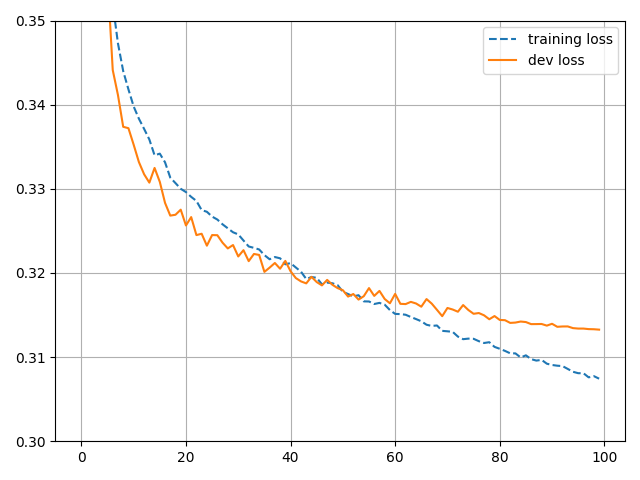
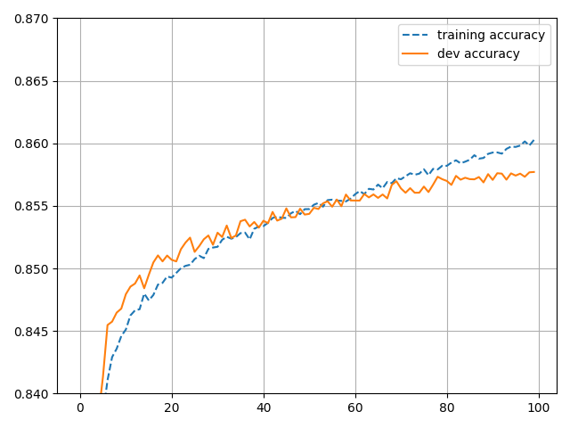
</div>
</br>

## 测试集上的结果

使用[XGBoost](./predict.py)和[MLP](./predict_mlp.py)在测试集上进行验证，结果如下：

| 算法           | test acc(%)   |
| -------------- | -------- |
| 多层感知机(MLP) | 85.625  |
| XGBoost        | 85.95  |
